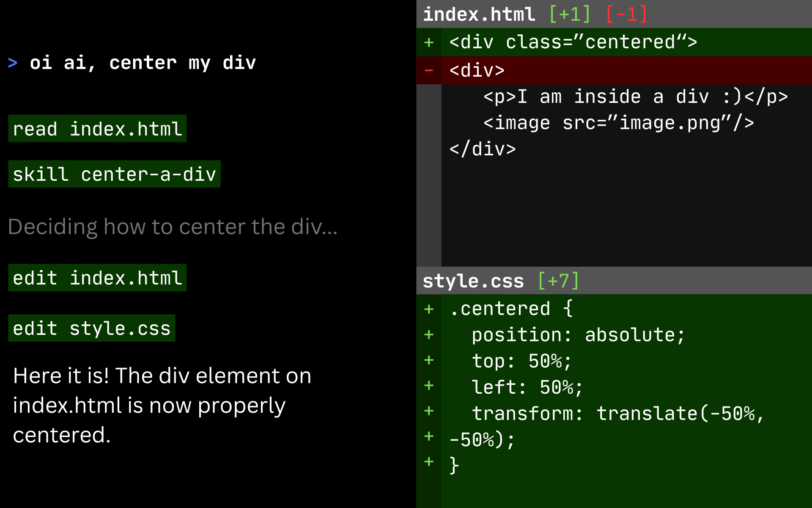

# Center a Div



> An agent skill to solve one of the hardest problems in computer science.

This skill works for any coding agent. It finds the best approach to center a div; complete with alignment tensors, container attachment theory, verification protocols, and a troubleshooting matrix with emergency fallback procedures.

## Installation

Clone or symlink into your OpenCode skills directory:

```bash
git clone https://github.com/Ryanswa28h/center-a-div ~/.agents/skills
```

Then reference it from `opencode.json` or load it via the `skill` tool.

## Contents

| File                                    | Lines |
| --------------------------------------- | ----- |
| `SKILL.md`                              | 233   |
| `references/alignment-theory.md`        | 99    |
| `references/container-relationships.md` | 95    |
| `references/supported-topologies.md`    | 287   |
| `references/verification-protocols.md`  | 196   |
| `references/troubleshooting-matrix.md`  | 129   |

## Usage

```bash
opencode
> center this div
# loads the skill automatically
```

Or manually:

```bash
opencode
> /skill center-a-div
> my div isn't centered vertically but it is horizontally
```

## 12 Dimensions of Alignment

| #   | Dimension         | Variable | Domain                                     |
| --- | ----------------- | -------- | ------------------------------------------ |
| 1   | Horizontal Offset | `H_off`  | `[-inf, +inf]` px                          |
| 2   | Vertical Offset   | `V_off`  | `[-inf, +inf]` px                          |
| 3   | Box-Sizing Mode   | `B_mode` | `{content-box, border-box}`                |
| 4   | Layout Topology   | `L_topo` | flex, grid, block, absolute, sticky, table |
| ... | ...               | ...      | ...                                        |

See `SKILL.md` for the full tensor.

## Disclaimer

This is a **NOT** joke. To center a div in 2026:

```css
.container {
  display: flex;
  justify-content: center;
  align-items: center;
}
```

There. Saved you 1039 lines.
