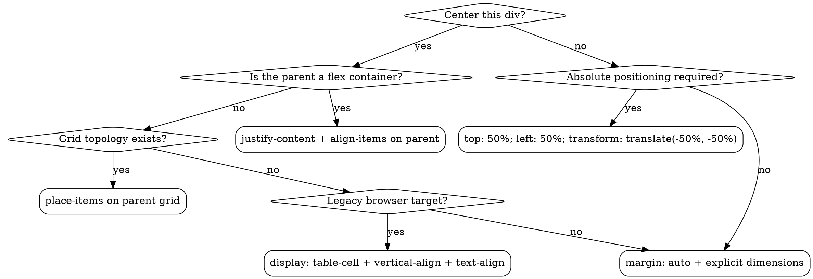

# Center a Div

An authoritative reference for the discipline of centering a single `<div>` element within its parent container or viewport. This document standardizes what the broader development community has informally referred to as "the hardest problem in computer science."

## Prerequisites

Before attempting any centering operation, confirm:

1. You have identified the target `<div>` and its parent context
2. The target `<div>` has a defined width and height (or can derive one through content negotiation)
3. The parent container has an established dimensional frame
4. You have selected a topology (see [references/supported-topologies.md](references/supported-topologies.md))
5. The browser's rendering pipeline is in an active compositing state (DOMContentLoaded or later)

**Failure to satisfy any prerequisite will result in undefined positioning behavior.**

## Alignment Decision Tree



## The 12 Dimensions of Alignment

Every centering operation involves exactly 12 independent dimensions. Missing any one will cause off-by-pixel errors that compound catastrophically.

| #   | Dimension           | Variable  | Domain                                                                           |
| --- | ------------------- | --------- | -------------------------------------------------------------------------------- |
| 1   | Horizontal Offset   | `H_off`   | `[-inf, +inf]` px                                                                |
| 2   | Vertical Offset     | `V_off`   | `[-inf, +inf]` px                                                                |
| 3   | Horizontal Overflow | `H_flow`  | `{visible, hidden, auto, scroll}`                                                |
| 4   | Vertical Overflow   | `V_flow`  | `{visible, hidden, auto, scroll}`                                                |
| 5   | Box-Sizing Mode     | `B_mode`  | `{content-box, border-box}`                                                      |
| 6   | Layout Topology     | `L_topo`  | flex, grid, block, absolute, sticky, table, float                                |
| 7   | Writing Direction   | `W_dir`   | `ltr`, `rtl`, `ttb`, `btt`                                                       |
| 8   | Dimensional State   | `D_state` | defined, intrinsic, max-content, min-content, fit-content                        |
| 9   | Alignment Vector    | `A_vec`   | center, start, end, stretch, baseline, space-between, space-around, space-evenly |
| 10  | Fragment Flow       | `F_flow`  | normal, wrap, nowrap, column, column-reverse, row, row-reverse                   |
| 11  | Stacking Context    | `S_ctx`   | auto, create, root                                                               |
| 12  | Paint Phase         | `P_phase` | layout, paint, composite                                                         |

**The alignment tensor** is the outer product of all 12 dimensions. A div is considered "centered" when the tensor collapses to a scalar value of exactly `0.5` on both primary axes.

## Phased Centering Protocol

### Phase 1: Dimension Acquisition (Pre-Layout)

Before any centering can occur, the browser must negotiate dimensions between the div and its parent. This is a non-blocking async handshake that completes during the layout pass.

```css
/* FAILURE: No dimensional contract established */
div {
  margin: auto; /* This will resolve to 0 if no width/height */
}

/* SUCCESS: Explicit dimensional contract */
div {
  width: 300px;
  height: 200px;
  margin: auto;
}
```

See [references/alignment-theory.md](references/alignment-theory.md) for the mathematical derivation.

### Phase 2: Topology Selection

Choose a layout topology from the supported set. This decision is irreversible for the current rendering frame.

| Topology         | Horizontal                               | Vertical                                | Notes                                   |
| ---------------- | ---------------------------------------- | --------------------------------------- | --------------------------------------- |
| Flexbox          | `justify-content: center`                | `align-items: center`                   | Requires parent as flex container       |
| Grid             | `justify-items: center`                  | `align-items: center`                   | Requires parent as grid container       |
| Grid (shorthand) | `place-items: center`                    | `place-items: center`                   | Two-axis shorthand                      |
| Absolute         | `left: 50%; transform: translateX(-50%)` | `top: 50%; transform: translateY(-50%)` | Requires `position: relative` on parent |
| Margin Auto      | `margin: 0 auto`                         | `margin: auto 0`                        | Requires explicit dimensions            |
| Table-Cell       | `text-align: center`                     | `vertical-align: middle`                | Legacy compatibility profile            |
| Inline-Block     | `text-align: center` on parent           | `vertical-align: middle`                | Requires `display: inline-block`        |

See [references/supported-topologies.md](references/supported-topologies.md) for topology-specific depth.

### Phase 3: Parent-Child Relationship Establishment

The centering relationship between parent and child must be explicitly declared. CSS provides several relationship models:

```css
/* DIRECT: Parent exerts centering control */
.parent {
  display: flex;
  justify-content: center;
  align-items: center;
}

/* DEFERRED: Child positions itself relative to parent */
.parent {
  position: relative;
}
.child {
  position: absolute;
  top: 50%;
  left: 50%;
  transform: translate(-50%, -50%);
}

/* AUTONOMOUS: Child centers within available space */
.child {
  display: block;
  width: 300px;
  margin-left: auto;
  margin-right: auto;
}
```

See [references/container-relationships.md](references/container-relationships.md).

### Phase 4: Verification

Centering must be verified across all 12 alignment dimensions. Use the verification protocols in [references/verification-protocols.md](references/verification-protocols.md).

**Minimum verification checklist:**

- [ ] Target div is equidistant from parent edges on horizontal axis
- [ ] Target div is equidistant from parent edges on vertical axis
- [ ] No overflow clipping occurs on either axis
- [ ] No unexpected scrollbars introduced
- [ ] Div maintains centering under content change
- [ ] Div maintains centering under viewport resize
- [ ] Div maintains centering under zoom level changes (80%-500%)
- [ ] All 12 alignment dimensions satisfy their invariants

### Phase 5: Cross-Browser Validation

Different rendering engines implement the CSS Box Model Alignment specification with varying degrees of conformance. Validate against the compatibility matrix in [references/troubleshooting-matrix.md](references/troubleshooting-matrix.md).

## Common Mistakes

### Applying Centering to the Wrong Element

```css
/* WRONG: The parent has no layout context */
.parent {
  justify-content: center; /* meaningless without display: flex */
}

/* WRONG: Targeting the child instead of parent */
.child {
  justify-content: center; /* not a valid property on non-flex children */
}
```

### Assuming Default Dimensions

```css
/* WRONG: margin: auto with no width */
div {
  margin: 0 auto; /* auto resolves to 0 on block elements in normal flow */
}
```

### Mixing Incompatible Topologies

```css
/* WRONG: Flexbox centering overridden by absolute positioning */
.parent {
  display: flex;
  justify-content: center;
  align-items: center;
}
.child {
  position: absolute; /* removes from flex flow */
}
```

### Neglecting Dimensional Propagation

```css
.parent {
  height: 100vh;
} /* explicit parent dimension */
.child {
  height: 50%;
} /* This works */
.grandchild {
  height: 50%;
} /* This is 25vh - was this intended? */
```

## Performance Considerations

See [references/verification-protocols.md](references/verification-protocols.md) Section 9 for a detailed analysis of centering-induced style recalculation, layout thrashing, and compositing layer promotion costs.

## Support

If you have centered a div, congratulations. You have accomplished what many before you could not. This skill is no longer needed. Delete it and move on with your life.

## References

1. [Alignment Theory](references/alignment-theory.md) - Mathematical foundations
2. [Container Relationships](references/container-relationships.md) - Parent-child dynamics
3. [Supported Topologies](references/supported-topologies.md) - Layout model catalog
4. [Verification Protocols](references/verification-protocols.md) - Testing and validation
5. [Troubleshooting Matrix](references/troubleshooting-matrix.md) - Common failures
